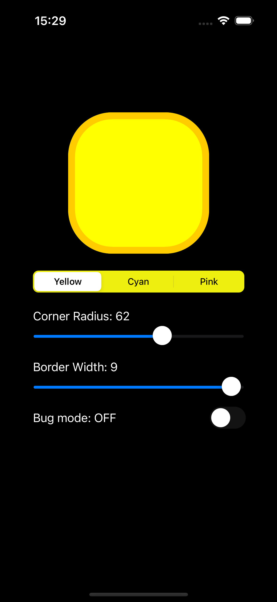
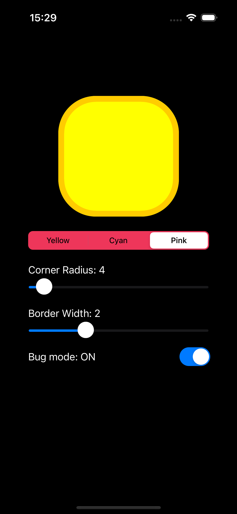
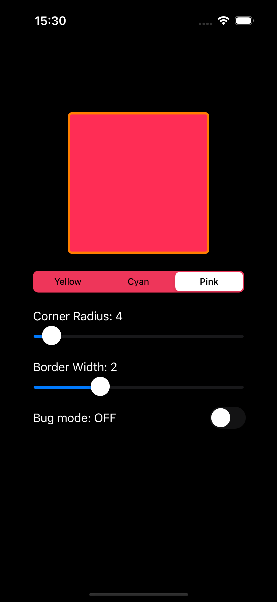

# 01 – RoundedViewLab

Topic #1 of the UIKit practice series. An interactive playground for exploring `CALayer` styling: corner radius, border, and fill color, all configurable at runtime. Includes a Bug Mode that demonstrates a classic UIKit pitfall.

## Screenshots

| Normal | Bug mode ON | Bug mode OFF |
|:---:|:---:|:---:|
|  |  |  |

## What it does

A custom `RoundedView` sits in the center of the screen. Controls below let you tweak its appearance live:

- **Corner Radius slider** (0–100) – updates `layer.cornerRadius`
- **Border Width slider** (0–10) – updates `layer.borderWidth`
- **Color segmented control** – switches between Yellow / Cyan / Pink themes (fill + matching border)
- **Bug Mode switch** – freezes layer state to demonstrate what breaks when you skip `layoutSubviews`

## Key decisions & what I learned

**`layoutSubviews` is the right place for `layer` configuration.** Layer properties like `cornerRadius` depend on the view's final `bounds`. If you apply them earlier (say, in `init`), `bounds` is still `.zero` and the values are meaningless. In `RoundedView`, all layer updates live inside `layoutSubviews`, which runs after every bounds change. `setNeedsLayout()` is called from the controller after each slider or color change to schedule the next pass.

**Bug Mode shows exactly what breaks.** `applyInBugMode()` applies layer properties once, outside the layout cycle. After that, moving the sliders changes the stored values but nothing re-applies them to the layer; `layoutSubviews` is bypassed because `isBugMode = true`. The second and third screenshots show this directly: same slider values, different visual result depending on the flag.

**ForEach for setup boilerplate.** Eight views need `translatesAutoresizingMaskIntoConstraints = false`. Putting them in an array and calling `.forEach` keeps it as one readable block instead of eight repeated lines.

**Index safety in `UISegmentedControl`.** `selectedSegmentIndex` returns `-1` when nothing is selected. Calling a handler before setting a default index crashes with index out of range. The fix is two lines: set `selectedSegmentIndex = 0` before calling the handler, and add a `guard sender.selectedSegmentIndex >= 0` at the top of the handler.

## Files

```
RoundedView.swift       # custom UIView subclass
ViewController.swift    # all controls, layout, event handling
```
