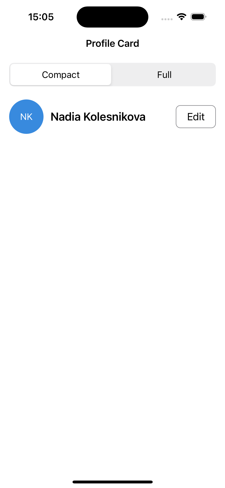
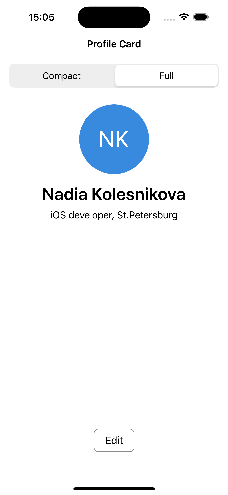
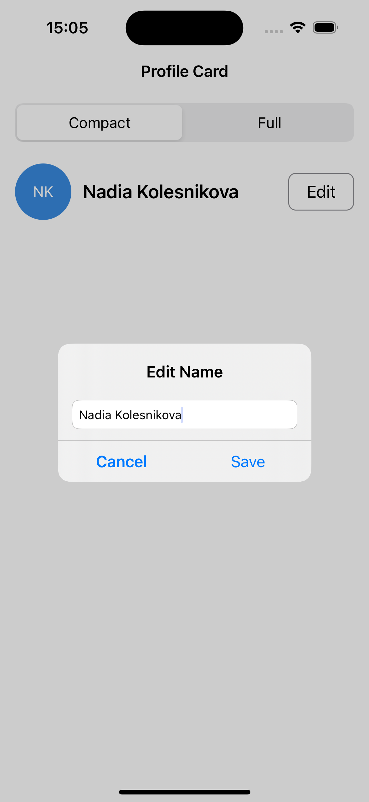

# 02 – Profile Card

Topic #2 of the UIKit practice series. A programmatic profile screen with two switchable layouts, no Storyboard, no XIB, zero Interface Builder.

## Screenshots

| Compact | Full | Edit |
|:---:|:---:|:---:|
|  |  |  |

## What it does

A profile card showing a generated avatar, name, and bio. A segmented control switches between **Compact** (horizontal, single-line) and **Full** (vertical, centered) layouts. Tapping **Edit** opens an alert to update the name; the change persists across launches.

## Key decisions & what I learned

**Two-constraint-set swap.** Two arrays (`compactConstraints` and `fullConstraints`) are built once in `setupConstraints()`. Switching calls `NSLayoutConstraint.deactivate` on the active set and `activate` on the other. This is cleaner than toggling individual constraints and avoids conflicts entirely.

**Avatar with auto-generated initials.** Instead of a static SF Symbol, the avatar is a plain `UIView` with a centered `UILabel` showing initials extracted by `makeInitials()`: one letter for a single name, two for first + last. `layer.cornerRadius` is updated on each layout switch to keep the circle proportional (30pt compact / 60pt full).

**Empty-name validation on the Save button.** The Save action is disabled via `NotificationCenter` observing `UITextField.textDidChangeNotification` inside `addTextField`. It checks the trimmed text on every keystroke; if empty, Save is greyed out. This gives immediate visual feedback instead of silently ignoring a tap.

**Memory safety in closures.** The edit alert captures both `self` and `alert` as `weak`: `[weak self, weak alert]`. Without `weak alert`, the closure would hold a strong reference to the alert, which holds the closure, creating a retain cycle.

**Name persists across launches.** The edited name is saved to `UserDefaults` on Save and loaded in `viewDidLoad`, so it survives app restarts. The initials label updates in sync.

**Code structure.** `viewDidLoad` is just four calls: `setupViews()`, `setupConstraints()`, `setupActions()`, and an initial layout pass. All implementation lives in private methods under `// MARK:` sections.

**Portrait-only, safe area throughout.** Rotation support was intentionally dropped; the card layout doesn't benefit from landscape. `safeAreaLayoutGuide` is still used for all leading/trailing constraints as a good habit for Dynamic Island and future device changes.

## Files

```
ViewController.swift    # all layout, constraints, actions, persistence
```

## What's intentionally different from the spec

The spec asked for editable bio — I switched it to editable name, which made the initials-in-avatar feature more interesting and interactive.
