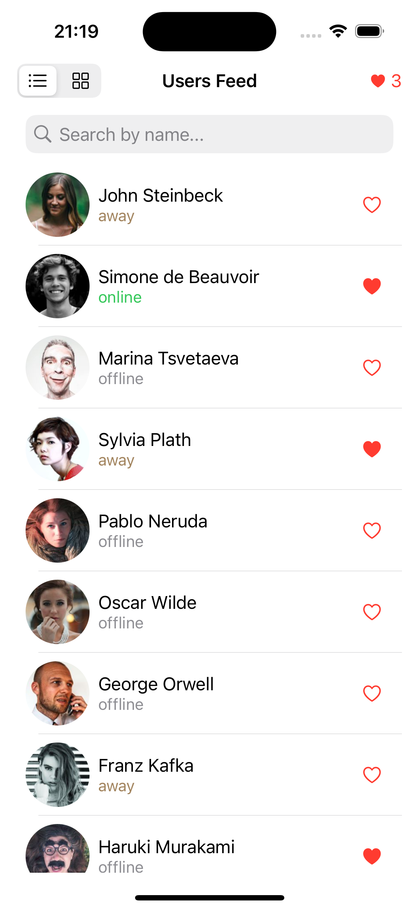
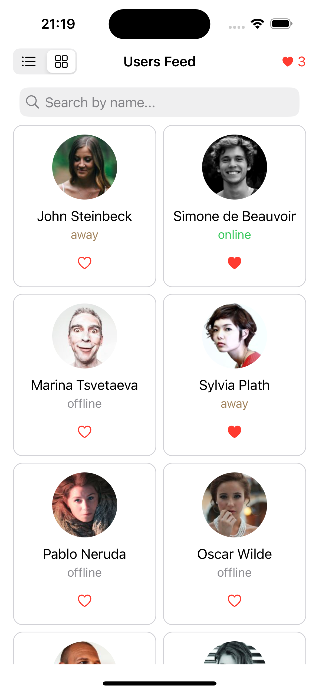
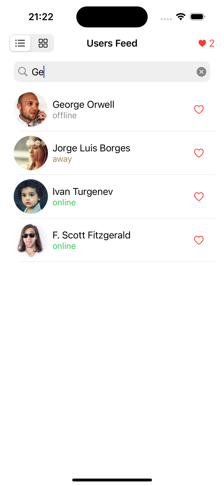

# 03 – Users Feed

Topic #3 of the UIKit practice series. A scrollable feed with switchable list/grid layouts, live search, pull-to-refresh, and per-user likes. No Storyboard.

## Screenshots

| List | Grid | Search |
|:---:|:---:|:---:|
|  |  |  |

## What it does

A feed of users, each with an async-loaded avatar, name, online status, and a like button. A segmented control (SF Symbol icons) switches between `UITableView` list and `UICollectionView` 2-column grid — both views live in memory simultaneously, so switching is instant with no teardown. Typing in the search bar filters by name in real time. Pull-to-refresh shuffles the list. The total likes count stays live in the navigation bar.

## Key decisions & what I learned

**Protocol extension instead of a base class.** `UserCell` and `UserCollectionCell` look different but share the same views (`avatarView`, `nameLabel`, `statusLabel`, `buttonLike`) and the same setup/configure logic. The `UserCardCell` protocol defines what views each cell must expose; a default extension on the protocol provides `setupCardViews()` and `configureCard()` to both. Neither cell duplicates a line of configuration code.

**Cells communicate upward via delegate, not closures.** Cells don't hold user data. When the heart is tapped, the cell fires `setLike(for id: UUID, _ isLiked: Bool)` on its `ButtonLikeDelegate`. The controller looks up the UUID in both `users` and `filteredUsers`, updates both, and refreshes the nav bar counter. The cell only owns its visual state.

**Two arrays: source and display.** The source array `users` is never mutated by search. `filteredUsers` is derived from it on every keystroke and on pull-to-refresh. Likes update both arrays by UUID so a liked item stays liked after filtering.

**Selective reload: search vs. refresh.** Search calls `reloadVisible()` (only the active view). Pull-to-refresh calls `reloadAll()` (both views), so switching layout after a shuffle shows fresh data immediately.

**Collection item size computed after layout.** Item size can't be set during setup because `collectionView.bounds` is zero when the view is hidden. Instead, the width is derived from `view.safeAreaLayoutGuide.layoutFrame.width - 32` (safe area width minus leading/trailing insets) inside `viewDidLayoutSubviews`, which is always valid regardless of which view is visible.

**Async image loading with cache and memory safety.** `ImageLoader` is a singleton backed by `NSCache<NSString, UIImage>` (limit: 30). Cache-first: if the image is cached, it's dispatched to main immediately with no network call. Otherwise `URLSession` fetches it, stores it, then dispatches. The closure captures `self` as `[weak self]` to avoid a retain cycle between the loader and the cell. `avatarView.image = nil` is reset in `configureCard` before each load to prevent stale images flashing during cell reuse.

## Files

```
Model/
  User.swift                  # User struct, StatusType enum
  MockData.swift              # static users array

View/
  SharedUserComponents.swift  # UserCardCell protocol + default extension, ButtonLikeDelegate
  UserCell.swift              # UITableViewCell conforming to UserCardCell
  UserCollectionCell.swift    # UICollectionViewCell conforming to UserCardCell

Services/
  ImageLoader.swift           # NSCache-backed async image loader

Controller/
  ViewController.swift        # layout toggle, search, refresh, like handling
```
